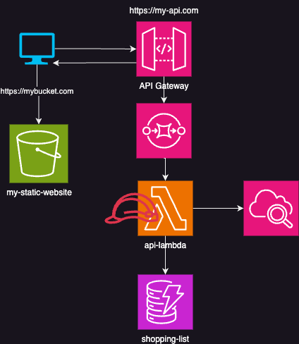

# Mein erstes API

## Allgemeine Infrastruktur

## API Dokumentation
`GET /allitems`: Gibt Alle Elemente der Shopping Liste zurück

`GET /itembyid/{itemdId}`: Gibt ein einzelnes Elemnt zurück.
**Parameter**: `itemId` - Einzigartige Id des Elements

`POST /addItem`: Fügt ein Item hinzu

`PUT /updateitembyid/{itemdId}`: Updatet ein Item anhand der ID
**Parameter**: `itemId` - Einzigartige Id des Elements

`DELETE /deleteitembyid/{itemdId}`: Löscht ein Item anhand der ID
**Parameter**: `itemId` - Einzigartige Id des Elements

 
